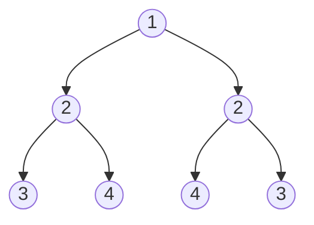

<meta name="referrer" content="no-referrer"/>

# 内容

**本节包括：**

- 二叉树（部分）

<!--more-->

## 101. 对称二叉树

给定一个二叉树，检查它是否是镜像对称的。



### 思路

对于二叉树是否对称，要比较的是根节点的左子树与右子树是不是相互翻转的，理解这一点就知道了**其实我们要比较的是两个树（这两个树是根节点的左右子树）**，所以在递归遍历的过程中，也是要同时遍历两棵树。

要比较两个节点数值相不相同，首先要把两个节点为空的情况弄清楚！否则后面比较数值的时候就会操作空指针了。

节点为空的情况有：（**注意我们比较的其实不是左孩子和右孩子，所以如下我称之为左节点右节点**）

- 左节点为空，右节点不为空，不对称，return false
- 左不为空，右为空，不对称 return false
- 左右都为空，对称，返回true

此时已经排除掉了节点为空的情况，那么剩下的就是左右节点不为空：

- 左右都不为空，比较节点数值，不相同就return false

此时左右节点不为空，且数值也不相同的情况我们也处理了。

### 代码实现

~~~java
public class IsSymmetricTree {
    public boolean isSymmetric(TreeNode root) {
        if (root == null) return true;
        return compare(root.left, root.right);
    }

    public boolean compare(TreeNode left, TreeNode right) {
        //首先排除空节点的情况
        if (left == null && right != null) return false;
        else if (left != null && right == null) return false;
        else if (left == null) return true;
            // 排除了空节点，再排除数值不相同的情况
        else if (left.val != right.val) return false;
        //比较外层和内层
        boolean outside = compare(left.left, right.right);
        boolean inside = compare(left.right, right.left);
        return outside && inside;

    }
}
~~~

##  104.二叉树的最大深度

推荐方法，递归法

~~~java
 public int maxDepth(TreeNode root) {
        if (root == null) return 0;
        return Math.max(maxDepth(root.left), maxDepth(root.right)) + 1;
    }
~~~

左子树和右子树的最大深度 *l* 和 *r*，那么该二叉树的最大深度即为
$$
m a x ( l , r ) + 1
$$

## 111.二叉树的最小深度

给定一个二叉树，找出其最小深度。

最小深度是从根节点到最近叶子节点的最短路径上的节点数量。

### 误区

不能简单粗暴的求`Math.min(minDepth(root.left),minDepth(root.right))+1`

因为当左右子树一空一不空的时候，该节点并不是叶子节点，应当选取不为空的分叉继续递归求二叉树的最小深度。

### 正确解法一：递归

~~~java
public int minDepth(TreeNode root) {
        if (root == null) return 0;
        //1、到达叶子节点
        if (root.left == null && root.right == null) return 1;
        int l = minDepth(root.left);
        int r = minDepth(root.right);
        //2、左右子树有一个为空，选择不为空的的分支，l和r其中国一个必为0
        if (root.left == null || root.right == null)
            return l + r + 1;
        //3、左右子树均不为空，子树最短路径+1
        return Math.min(l, r) + 1;
        
    }
~~~

情况1和二可以合并

~~~java
 public int minDepth(TreeNode root) {
       if(root == null) return 0;
        int m1 = minDepth(root.left);
        int m2 = minDepth(root.right);
        //1.如果左孩子和右孩子有为空的情况，直接返回m1+m2+1
        //2.如果都不为空，返回较小深度+1
        return root.left == null || root.right == null ? m1 + m2 + 1 : Math.min(m1,m2) + 1;
    }
~~~

### 正确解法二：层序遍历

~~~java
public int minDepth(TreeNode root) {
        if (root == null) {
            return 0;
        }
        Queue<TreeNode> queue = new LinkedList<>();
        queue.offer(root);
        int depth = 0;
        while (!queue.isEmpty()){
            int size = queue.size();
            depth++;
            TreeNode cur = null;
            for (int i = 0; i < size; i++) {
                cur = queue.poll();
                //如果当前节点的左右孩子都为空，直接返回最小深度
                if (cur.left == null && cur.right == null){
                    return depth;
                }
                if (cur.left != null) queue.offer(cur.left);
                if (cur.right != null) queue.offer(cur.right);
            }
        }
        return depth;
    }
~~~

## 226.翻转二叉树

给你一棵二叉树的根节点 `root` ，翻转这棵二叉树，并返回其根节点。

### 方法

前序遍历，左右子树翻转

~~~java
public class InvertBinTree {
    public TreeNode invertTree(TreeNode root) {
        preOrderInvertTree(root);
        return root;
    }

    public void preOrderInvertTree(TreeNode node) {
        if (node == null) return;
        swapChild(node);
        preOrderInvertTree(node.left);
        preOrderInvertTree(node.right);
    }

    public void swapChild(TreeNode node) {
        TreeNode tmpNode = node.right;
        node.right = node.left;
        node.left = tmpNode;
    }
}
~~~

## 222.完全二叉树的节点个数

给你一棵 **完全二叉树** 的根节点 `root` ，求出该树的节点个数。

> 先求它的左子树的节点数量，再求右子树的节点数量，最后取总和再加一 （加1是因为算上当前中间节点）就是目前节点为根节点的节点数量。

~~~java
public int countNodes(TreeNode root) {
        if (root == null) return 0;
        return countNodes(root.left) + countNodes(root.right) + 1;
    }
~~~

## 110.平衡二叉树

给定一个二叉树，判断它是否是高度平衡的二叉树。

### 思路

比较每一个节点的左右子树的高度差是否大于1

### 错误解法

~~~java
public boolean isBalanced(TreeNode root) {
        return maxDepthBalance(root) != -1;

    }

    public int maxDepthBalance(TreeNode node) {
        if (node == null) return 0;
        return Math.abs(maxDepthBalance(node.left) - maxDepthBalance(node.right)) > 1 ? -1 : Math.max(maxDepthBalance(node.left), maxDepthBalance(node.right)) + 1;
    }
~~~

没有考虑到`maxDepthBalance(node.left) - maxDepthBalance(node.right)`其中或许已经存在-1这种结果而不是真实的高度了

### 正确解法

如果当前传入节点为根节点的二叉树已经不是二叉平衡树了，还返回高度的话就没有意义了。

所以如果已经不是二叉平衡树了，可以返回-1 来标记已经不符合平衡树的规则了。

~~~java
 public boolean isBalanced(TreeNode root) {
        return maxDepthBalance(root) != -1;

    }

    /**
     * 所以如果已经不是二叉平衡树了，可以返回-1 来标记已经不符合平衡树的规则了。
     *
     * @param node
     * @return
     */
    public int maxDepthBalance(TreeNode node) {
        if (node == null) return 0;
        int leftDepth = maxDepthBalance(node.left);
        if (leftDepth == -1) return -1;
        int rightDepth = maxDepthBalance(node.right);
        if (rightDepth == -1)
            return -1;
        if (Math.abs(leftDepth - rightDepth) > 1) return -1;

        return Math.max(leftDepth, rightDepth) + 1;
    }
~~~

## 257.二叉树的所有路径

给定一个二叉树，返回所有从根节点到叶子节点的路径。

说明: 叶子节点是指没有子节点的节点。

### 法一

采用采用递归和回溯的方法求取所有路径

~~~java
List<String> res = new ArrayList<>();
public List<String> binaryTreePaths(TreeNode root) {
    if (root == null) return res;
    //traversal方法
    List<Integer> paths = new ArrayList<>();//已经遍历的节点
    traversal(root, paths, res);
    return res;
}
 public void traversal(TreeNode node, List<Integer> paths, List<String> res) {
        paths.add(node.val);//加入当前节点到路径
        if (node.left == null && node.right == null) {
            StringBuilder sb = new StringBuilder();
            for (int i = 0; i < paths.size() - 1; i++) {// 将paths里记录的路径转为string格式
                sb.append(paths.get(i)).append("->");
            }
            sb.append(paths.get(paths.size() - 1));//加上最后一个节点（单独处理）
            res.add(sb.toString());//加入一个叶子节点的路径
            return;
        }
        //遍历左右节点路径，并回溯
        if (node.left != null) {
            traversal(node.left, paths, res);
            paths.remove(paths.size() - 1);//回溯
        }
        if (node.right != null) {
            traversal(node.right, paths, res);
            paths.remove(paths.size() - 1);
        }
    }
~~~

### 法二

采用不断生长公共子节点的方法

~~~java
List<String> res = new ArrayList<>();

    public List<String> binaryTreePaths(TreeNode root) {
        if (root == null) return res;
        growthTraversal(root, "");
        return res;
    }
public void growthTraversal(TreeNode node, String s) {
    if (node.left == null && node.right == null) {
        res.add(new StringBuilder(s).append(node.val).toString());
        return;
    }
    String tmp = new StringBuilder(s).append(node.val).append("->").toString();
    if (node.left != null) {
        growthTraversal(node.left, tmp);
    }
    if (node.right != null) {
        growthTraversal(node.right, tmp);
    }
}
~~~

### 小技巧

> 使用StringBuilder进行字符串拼接通常比直接使用字符串相加的方式更高效。这是因为StringBuilder是可变的，允许在同一对象上进行多次追加操作，而不会每次都创建一个新的字符串对象。

## 404.左叶子之和

给定二叉树的根节点 `root` ，返回所有左叶子之和。

### 法一 基于DFS

基于深度层序遍历，累加左叶子之和

~~~java
public int res = 0;
public int sumOfLeftLeaves(TreeNode root) {
    if (root == null) return res;
    levelOrder(root);
    return res;
}

public boolean isLeaf(TreeNode node) {
    if (node.left == null && node.right == null)
        return true;
    else return false;
}

public void levelOrder(TreeNode node) {
    if (node == null) return;
    if (node.left != null) {
        if (isLeaf(node.left)) {
            res += node.left.val;
        }
        levelOrder(node.left);
    }
    if (node.right != null) {
        levelOrder(node.right);
    }
}
~~~

## 513.找树左下角的值

给定一个二叉树的 **根节点** `root`，请找出该二叉树的 **最底层 最左边** 节点的值。

假设二叉树中至少有一个节点。

**示例 2:**


```
输入: [1,2,3,4,null,5,6,null,null,7]
输出: 7
```

### 法一 基于广度优先遍历

不断更新每一层的节点的最左边的的节点值

~~~java
public class FindBottomLeftValue {
    public int res;

    public int findBottomLeftValue(TreeNode root) {
        BFSFindBottomLeftValue(root);
        return res;
    }

    public void BFSFindBottomLeftValue(TreeNode node) {
        if (node == null) return;
        Queue<TreeNode> queue = new LinkedList<>();
        queue.offer(node);

        while (!queue.isEmpty()) {
            int size = queue.size();
            for (int i = 0; i < size; i++) {
                TreeNode tmp = queue.poll();
                if (i == 0) res = tmp.val;
                if (tmp.left != null) queue.offer(tmp.left);
                if (tmp.right != null) queue.offer(tmp.right);
            }
        }
    }
}
~~~

### 法二 基于深度优先搜索-递归

~~~java
public class FindBottomLeftValueRecursive {
    public int Deep = 0;
    public int value = 0;

    public int findBottomLeftValue(TreeNode root) {
        preOrderFindLeftBottomValue(root, 1);
        return value;
    }

    public void preOrderFindLeftBottomValue(TreeNode node, int deep) {
        if (node == null) return;
        if (node.left == null && node.right == null) {
            if (deep > Deep) {
                Deep = deep;
                value = node.val;
            }
        }
        preOrderFindLeftBottomValue(node.left, deep + 1);
        preOrderFindLeftBottomValue(node.right, deep + 1);
    }
}
~~~

## 112.路径总和

给你二叉树的根节点 `root` 和一个表示目标和的整数 `targetSum` 。判断该树中是否存在 **根节点到叶子节点** 的路径，这条路径上所有节点值相加等于目标和 `targetSum` 。如果存在，返回 `true` ；否则，返回 `false` 。

**叶子节点** 是指没有子节点的节点。

### 法一

#### 思路

找到所有路径，然后求和

#### 代码

~~~java
public class HasPathSum {

    List<List<Integer>> paths = new ArrayList<List<Integer>>();
    public boolean res = false;

    public boolean hasPathSum(TreeNode root, int targetSum) {
        List<Integer> path = new ArrayList<>();
        getPath(root, path);
        return compareSum(paths, targetSum);
    }

    public void getPath(TreeNode node, List<Integer> path) {
        if (node == null) return;
        // 创建 path 的副本
        List<Integer> copyOfPath = new ArrayList<>(path);
        copyOfPath.add(node.val);
        //叶子节点，加入路径
        if (node.left == null && node.right == null) {
            paths.add(copyOfPath);
            return;
        }
        //左右节点，继续向下遍历
        if (node.left != null) getPath(node.left, copyOfPath);
        if (node.right != null) getPath(node.right, copyOfPath);
    }

    public boolean compareSum(List<List<Integer>> paths, int targetSum) {
        List<Integer> sums = new ArrayList<>();
        for (List<Integer> path : paths) {
            //求每条路径和
            int tmpSum = 0;
            for (Integer i : path) {
                tmpSum += i;
            }
            if (tmpSum == targetSum) {
                return true;
            }
        }
        return false;
    }

}
~~~

### 法二

#### 递归法

~~~java
class Solution {
    public boolean hasPathSum(TreeNode root, int targetSum) {
        if (root == null) {
            return false;
        }
        // 叶子节点直接在这里结束。因为传入null，一定就是false，那整颗树就一定是false
        if (root.left == null && root.right == null) {
            return targetSum == root.val;
        }

        int newTargetSum = targetSum - root.val;
        boolean leftHasPathSum = hasPathSum(root.left, newTargetSum);
        boolean rightHasPathSum = hasPathSum(root.right, newTargetSum);

        return leftHasPathSum || rightHasPathSum;
    }
}
~~~

## 654.最大二叉树

给定一个不重复的整数数组 `nums` 。 **最大二叉树** 可以用下面的算法从 `nums` 递归地构建:

1. 创建一个根节点，其值为 `nums` 中的最大值。
2. 递归地在最大值 **左边** 的 **子数组前缀上** 构建左子树。
3. 递归地在最大值 **右边** 的 **子数组后缀上** 构建右子树。

返回 `nums` 构建的 **最大二叉树** 。

~~~java
public class ConstructMaximumBinaryTree {
    public TreeNode constructMaximumBinaryTree(int[] nums) {
        return buildHelper(nums, 0, nums.length);
    }

    private TreeNode buildHelper(int[] nums, int left, int right) {
        //叶子节点
        TreeNode node = new TreeNode();
        if (right - left == 1) {
            node.val = nums[left];
            return node;
        }
        //空叶子
        if (left >= right) {
            return null;
        }
        //递归构建左子树、右子树
        int maxIndex = getMaxIndex(nums, left, right);
        node.val = nums[maxIndex];
        node.left = buildHelper(nums, left, maxIndex);
        node.right = buildHelper(nums, maxIndex + 1, right);
        return node;
    }
    //获取局部数组的最大值索引
    private int getMaxIndex(int[] nums, int begin, int end) {
        int maxValue = 0;
        int maxIndex = 0;
        for (int i = begin; i < end; i++) {
            if (nums[i] > maxValue) {
                maxIndex = i;
                maxValue = nums[i];
            }
        }
        return maxIndex;
    }
}
~~~

## 617.合并二叉树

给你两棵二叉树： `root1` 和 `root2` 。

想象一下，当你将其中一棵覆盖到另一棵之上时，两棵树上的一些节点将会重叠（而另一些不会）。你需要将这两棵树合并成一棵新二叉树。合并的规则是：如果两个节点重叠，那么将这两个节点的值相加作为合并后节点的新值；否则，**不为** null 的节点将直接作为新二叉树的节点。

返回合并后的二叉树。

~~~java
public TreeNode mergeTrees(TreeNode root1, TreeNode root2) {
        if (root1 == null) return root2;
        if (root2 == null) return root1;
        root1.val += root2.val;
        root1.left = mergeTrees(root1.left, root2.left);
        root1.right = mergeTrees(root1.right, root2.right);
        return root1;
}
~~~

## 700.二叉搜索树中的搜索

给定二叉搜索树（BST）的根节点 `root` 和一个整数值 `val`。

你需要在 BST 中找到节点值等于 `val` 的节点。 返回以该节点为根的子树。 如果节点不存在，则返回 `null` 。

~~~java
public TreeNode searchBST(TreeNode root, int val) {
        if (root == null || root.val == val) {
            return root;
        }
        TreeNode left = searchBST(root.left, val);
        if (left != null) {
            return left;
        }
        return searchBST(root.right, val);
    }
~~~

~~~java
// 递归，利用二叉搜索树特点，优化
    public TreeNode searchBST(TreeNode root, int val) {
        if (root == null || root.val == val) {
            return root;
        }
        if (val < root.val) {
            return searchBST(root.left, val);
        } else {
            return searchBST(root.right, val);
        }
    }
~~~

## 98.验证二叉搜索树

给你一个二叉树的根节点 `root` ，判断其是否是一个有效的二叉搜索树。

**有效**二叉搜索树定义如下：

- 节点的左子树只包含 **小于** 当前节点的数。
- 节点的右子树只包含 **大于** 当前节点的数。
- 所有左子树和右子树自身必须也是二叉搜索树。

### 思路

中序遍历二叉树，如果不是递增的就不是二叉搜索树

### 坑

1. 中序遍历，递归法

~~~java
 public void inOrder(TreeNode root) {
        if (root == null)
            return;
        inOrder(root.left);
        queue.offer(root.val);
        inOrder(root.right);
    }
~~~

2. 左边数值>=右边数值均为false

~~~java
if (node1 >= node2) {
   return false;
}
~~~

3. 变量不能作为for循环的边界

~~~java
int queueSize = queue.size();
for (int i = 0; i < queueSize - 1; i++) 
~~~

### 总代码

~~~java
public Queue<Integer> queue = new LinkedList<>();

public boolean isValidBST(TreeNode root) {
    inOrder(root);
    int queueSize = queue.size();
    for (int i = 0; i < queueSize - 1; i++) {
        int node1 = queue.poll();
        int node2 = queue.peek();
        if (node1 >= node2) {
            return false;
        }
    }
    return true;
}

public void inOrder(TreeNode root) {
    if (root == null)
        return;
    inOrder(root.left);
    queue.offer(root.val);
    inOrder(root.right);
}
~~~

推荐代码-中序遍历

~~~java
private long pre = Long.MIN_VALUE;
public boolean isValidBST(TreeNode root) {
        if (root == null) return true;
        if (!isValidBST(root.left)) {
            return false;
        }
        if (pre > root.val) {
            return false;
        }
        pre = root.val;
        return isValidBST(root.right);
    }
~~~

## 530.二叉搜索树的最小绝对差

给你一个二叉搜索树的根节点 `root` ，返回 **树中任意两不同节点值之间的最小差值** 。

差值是一个正数，其数值等于两值之差的绝对值。

### 思路

中序遍历，求得到的数组两点间的绝对值最小值

### 易错点

1. 成员变量一定要初始化，不然会是空
2. 初始最小值一定要设的足够大

### 总代码

~~~java
public List<Integer> list = new ArrayList<>();
public int getMinimumDifference(TreeNode root) {
    inOrder(root);
    int size = list.size();
    int minAbsDis = Integer.MAX_VALUE;
    for (int i = 0; i < size - 1; i++) {
        int tmp = list.get(i + 1) - list.get(i);
        if (minAbsDis > tmp) {
            minAbsDis = tmp;
        }
    }
    return minAbsDis;
}

private void inOrder(TreeNode root) {
    if (root == null) return;
    inOrder(root.left);
    list.add(root.val);
    inOrder(root.right);
}
~~~

## 501.二叉搜索树中的众数

给你一个含重复值的二叉搜索树(BST)的根节点root,，找出并返回BST中的所有众数(即，出现频率最高的元素)。
如果树中有不止一个众数，可以按任意顺序返回。
假定BST满足如下定义：

1. 结点左子树中所含节点的值小于等于当前节点的值
2. 结点右子树中所含节点的值大于等于当前节点的值
3. 左子树和右子树都是二叉搜索树

### 思路

- 中序遍历
- 弄一个指针指向前一个节点，这样每次cur（当前节点）才能和pre（前一个节点）作比较。
- 而且初始化的时候pre = NULL，这样当pre为NULL时候，我们就知道这是比较的第一个元素。
- 与前一个节点数值不同，新值count = 1
- 与前一个节点数值相同，count加1
- 频率count 等于 maxCount（最大频率），当然要把这个元素加入到结果集中
- count>maxCount,清除以前的众数，添加当前元素
- 指针后移

~~~java
public class FindMode2 {
    ArrayList<Integer> resList;
    int maxCount;
    int count;
    TreeNode pre;

    public int[] findMode(TreeNode root) {
        resList = new ArrayList<>();
        maxCount = 0;
        count = 0;
        pre = null;
        inOrder(root);
        int[] res = new int[resList.size()];
        for (int i = 0; i < resList.size(); i++) {
            res[i] = resList.get(i);
        }
        return res;
    }

    private void inOrder(TreeNode root) {
        if (root == null) return;
        inOrder(root.left);
        int nodeValue = root.val;
        //相同数值，增加频数
        if (pre != null && nodeValue == pre.val) {
            count += 1;
        } else {//第一次出现
            count = 1;
        }
        if (count == maxCount) resList.add(nodeValue);
        if (count > maxCount) {
            maxCount = count;
            resList.clear();
            resList.add(nodeValue);
        }
        //后移前指针
        pre = root;

        inOrder(root.right);
    }
}
~~~

## 236. 二叉树的最近公共祖先

给定一个二叉树, 找到该树中两个指定节点的最近公共祖先。

[百度百科](https://baike.baidu.com/item/最近公共祖先/8918834?fr=aladdin)中最近公共祖先的定义为：“对于有根树 T 的两个节点 p、q，最近公共祖先表示为一个节点 x，满足 x 是 p、q 的祖先且 x 的深度尽可能大（**一个节点也可以是它自己的祖先**）。

### 思路

情况一：如果找到一个节点，发现左子树出现结点p，右子树出现节点q，或者 左子树出现结点q，右子树出现节点p，那么该节点就是节点p和q的最近公共祖先。


情况二：节点本身p(q)，它拥有一个子孙节点q(p)


情况一二代码的实现逻辑一样，即：**如果递归遍历遇到q，就将q返回，遇到p 就将p返回，那么如果左右子树的返回值都不为空，说明此时的中节点，一定是q 和p 的最近祖先。**

**注意：利用后续遍历**

### 代码实现

~~~java
public class LowestCommonAncestor2 {
    public TreeNode lowestCommonAncestor(TreeNode root, TreeNode p, TreeNode q) {
        if (root == p || root == q || root == null) return root;

        TreeNode left = lowestCommonAncestor(root.left, p, q);
        TreeNode right = lowestCommonAncestor(root.right, p, q);

        if (left != null && right != null) return root;
        if (left == null) return right;
        return left;
        }
    }
}
~~~

## 235.二叉搜索树的最近公共祖先

给定一个二叉搜索树, 找到该树中两个指定节点的最近公共祖先。

[百度百科](https://baike.baidu.com/item/最近公共祖先/8918834?fr=aladdin)中最近公共祖先的定义为：“对于有根树 T 的两个结点 p、q，最近公共祖先表示为一个结点 x，满足 x 是 p、q 的祖先且 x 的深度尽可能大（**一个节点也可以是它自己的祖先**）。”

- 所有节点的值都是唯一的。
- p、q 为不同节点且均存在于给定的二叉搜索树中。

### 思路

我们从根节点搜索，第一次遇到cur节点是数值在[q, p]区间中，即节点5，此时可以说明 q 和 p 一定分别存在于节点5的左子树，和右子树中。

###  代码

~~~java
public TreeNode lowestCommonAncestor(TreeNode root, TreeNode p, TreeNode q) {
        if (root.val > p.val && root.val > q.val) {
            return lowestCommonAncestor(root.left, p, q);
        } else if (root.val < p.val && root.val < q.val) {
            return lowestCommonAncestor(root.right, p, q);
        } else {
            return root;
        }
    }
~~~

##  701.二叉搜索树中的插入操作

给定二叉搜索树（BST）的根节点和要插入树中的值，将值插入二叉搜索树。 返回插入后二叉搜索树的根节点。 输入数据保证，新值和原始二叉搜索树中的任意节点值都不同。

#### 思路

根据二叉搜索树的特性，不断递归，找到可以插入的叶子节点。

~~~java
public TreeNode insertIntoBST(TreeNode root, int val) {
        if (root == null) return new TreeNode(val);
        if (root.val > val && root.left != null) {
            insertIntoBST(root.left, val);
        } else if (root.val < val && root.right != null) {
            insertIntoBST(root.right, val);
        } else if (root.val > val) {
            root.left = new TreeNode(val);
        } else if (root.val < val) {
            root.right = new TreeNode(val);
        }
        return root;
    }
~~~

简化

~~~java
public TreeNode insertIntoBST(TreeNode root, int val) {
    if (root == null) // 如果当前节点为空，也就意味着val找到了合适的位置，此时创建节点直接返回。
        return new TreeNode(val);
    if (root.val < val){
        root.right = insertIntoBST(root.right, val); // 递归创建右子树
    }else if (root.val > val){
        root.left = insertIntoBST(root.left, val); // 递归创建左子树
    }
    return root;
}
~~~

## 450.删除二叉搜索树中的节点

给定一个二叉搜索树的根节点 root 和一个值 key，删除二叉搜索树中的 key 对应的节点，并保证二叉搜索树的性质不变。返回二叉搜索树（有可能被更新）的根节点的引用。

### 思路

- 第一种情况：没找到删除的节点，遍历到空节点直接返回了
- 找到删除的节点
  - 第二种情况：左右孩子都为空（叶子节点），直接删除节点， 返回NULL为根节点
  - 第三种情况：删除节点的左孩子为空，右孩子不为空，删除节点，右孩子补位，返回右孩子为根节点
  - 第四种情况：删除节点的右孩子为空，左孩子不为空，删除节点，左孩子补位，返回左孩子为根节点
  - 第五种情况：左右孩子节点都不为空，则将删除节点的左子树头结点（左孩子）放到删除节点的右子树的最左面节点的左孩子上，返回删除节点右孩子为新的根节点。


### 代码实现

~~~java
public TreeNode deleteNode(TreeNode root, int key) {
        //没有找到，返回空指针
        if (root == null) return null;
        //当前节点为删除节点
        if (root.val == key) {
            //删除的节点左右子树至少有一个为空,3种情况
            if (root.left == null) return root.right;
            else if (root.right == null) return root.left;
                //左右子树均不为空，当前节点左子树插入右子树的最左端叶子节点
            else {
                TreeNode insertPos = root.right;
                while (insertPos.left != null) {
                    insertPos = insertPos.left;
                }
                insertPos.left = root.left;
                return root.right;
            }
        }
        //删除节点在左边
        if (root.val > key) root.left = deleteNode(root.left, key);
        //删除节点在右边
        if (root.val < key) root.right = deleteNode(root.right, key);
        //返回根节点
        return root;
    }
~~~

## 669. 修剪二叉搜索树

给定一个二叉搜索树，同时给定最小边界L 和最大边界 R。通过修剪二叉搜索树，使得所有节点的值在[L, R]中 (R>=L) 。你可能需要改变树的根节点，所以结果应当返回修剪好的二叉搜索树的新的根节点。


### 思路

1. 修剪的操作并不是在终止条件上进行的，所以就是遇到空节点返回就可以了。

~~~java
 if (root == null) return null;
~~~

2. 确定单层递归的逻辑：

- 如果root（当前节点）的元素小于low的数值，那么应该递归右子树，并返回右子树符合条件的头结点。
- 如果root(当前节点)的元素大于high的，那么应该递归左子树，并返回左子树符合条件的头结点。

3. 接下来要将下一层处理完左子树的结果赋给root->left，处理完右子树的结果赋给root->right。

4. 最后返回root节点

### 代码实现-递归

~~~java
public TreeNode trimBST(TreeNode root, int low, int high) {
    if (root == null) return null;
    //当前节点小于low，判断当前右子树是否有在[low,high]区间的节点
    if (root.val < low) {
        return trimBST(root.right, low, high);
    }
    //当前节点大于high，判断当前左子树是否有在[low,high]区间的节点
    if (root.val > high) {
        return trimBST(root.left, low, high);
    }
    root.left = trimBST(root.left, low, high);// root->left接入符合条件的左孩子
    root.right = trimBST(root.right, low, high);// root->right接入符合条件的右孩子
    return root;
}
~~~

### 代码实现-迭代-了解

~~~java
class Solution {
    //iteration
    public TreeNode trimBST(TreeNode root, int low, int high) {
        if(root == null)
            return null;
        while(root != null && (root.val < low || root.val > high)){
            if(root.val < low)
                root = root.right;
            else
                root = root.left;
        }

        TreeNode curr = root;
        
        //deal with root's left sub-tree, and deal with the value smaller than low.
        while(curr != null){
            while(curr.left != null && curr.left.val < low){
                curr.left = curr.left.right;
            }
            curr = curr.left;
        }
        //go back to root;
        curr = root;

        //deal with root's righg sub-tree, and deal with the value bigger than high.
        while(curr != null){
            while(curr.right != null && curr.right.val > high){
                curr.right = curr.right.left;
            }
            curr = curr.right;
        }
        return root;
    }
}
~~~

